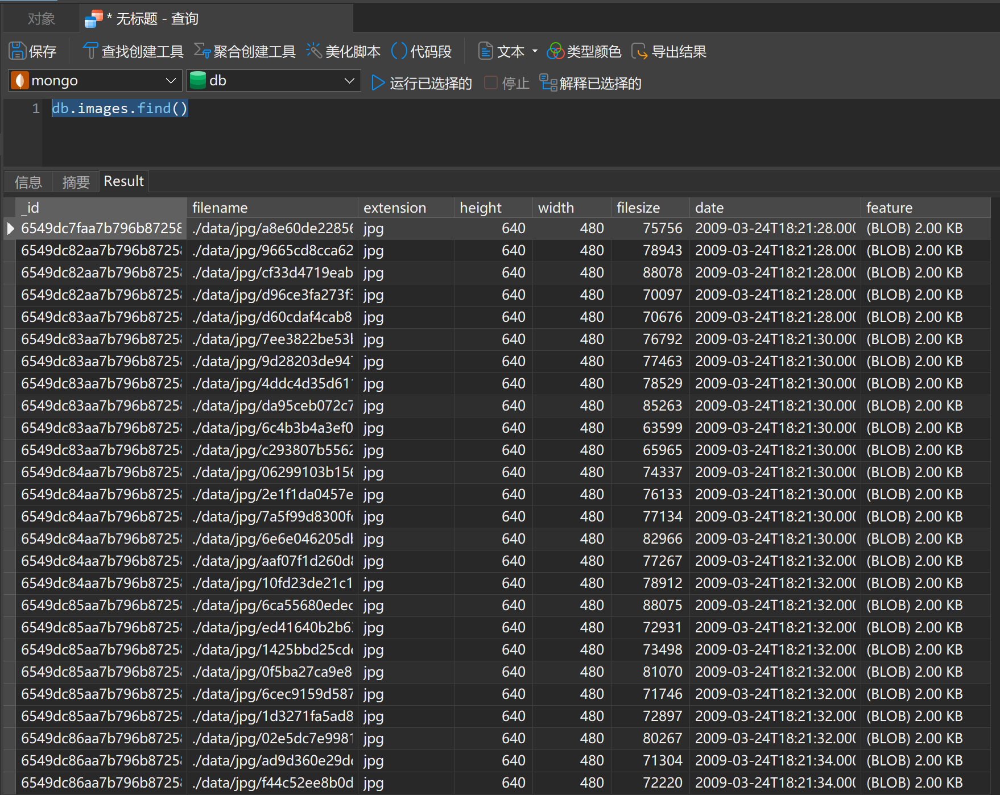

#### 开发环境

```shell
$ lsb_release -a
No LSB modules are available.
Distributor ID: Ubuntu
Description:    Ubuntu 22.04.3 LTS
Release:        22.04
Codename:       jammy
$ docker-compose --version
Docker Compose version v2.6.1
$ docker --version
Docker version 24.0.6, build ed223bc
$ python --version
Python 3.11.3
$ pip -V
pip 23.1.2
```

docker，pip需要换源

#### 工作目录

```shell
$ pwd
****/ISE2023Autumn
```

#### 启动mongodb

```shell
$ docker-compose up iseMongodb -d
[+] Running 1/1
 ⠿ Network ise2023autumn_default  Created
```

#### 在mongodb里创建数据库和集合

```sQL
use db
db.createCollection("images")
db.images.find()
```

此处返回为空

#### 安装依赖

```shell
$ pip install -r requirements.txt
```

#### 数据放入imgs文件夹，导入数据库

目前不支持文件夹嵌套文件夹，需要将导入照片直接存入`./imgs`文件夹下，之后执行如下命令

```shell
$ python import_images.py 
[DEBUG] CLIP model loaded in 3.296 seconds
100%|█████████████████████████████████████████████████████████████████████████████████████████████████████| 84/84 [00:07<00:00, 11.00it/s]
```

等待一段时间后，在mongodb里查询数据是否成功导入

```sql
db.images.find()
```



#### 运行server.py

```shell
$ python ./server.py
```

