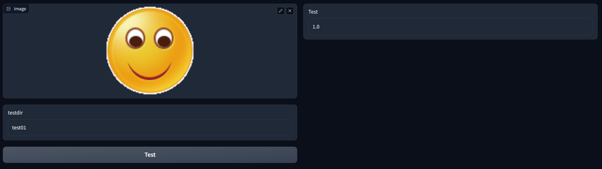

#### 数据

爬虫脚本为`crawl.py`(不重要)

链接：[https://pan.baidu.com/s/1FDCqNCVHt6gIoxUjI96N8g?pwd=1234](https://pan.baidu.com/s/1FDCqNCVHt6gIoxUjI96N8g?pwd=1234 )
提取码：1234 

解压到`./imgs`目录下，运行`import_images.py`

#### 不满意

点击`Not Satisfy`按钮可以让图片多生成8张，后台设置上限总数为64张

#### 下载

点击`Download` 可以打包下载到`./download`文件夹的`Emoji.zip`里

#### 测试

修改了测试规则，加载测试文件和测试目录test文件夹名称

如下图，上传`./imgs/test01`下的一张图片，填写文件文件夹名称`test01`，点击测试

系统会加载64张图片（或假设返回的图片数目为n）

test01下有16张图片（或假设test目录下图片数目为m）

上面的两个集合取个交集，设交集内元素个数为t，则返回的数值为(t/m)

该图显示情况为交集内元素的个数为16

